# 用户手册

[toc]

## 首页

首页主要作为展示用途，在首页显示了两大版块，分别为封面故事和精选内容，如图1

精选内容每天都会定时更新成版块中比较热门的帖子

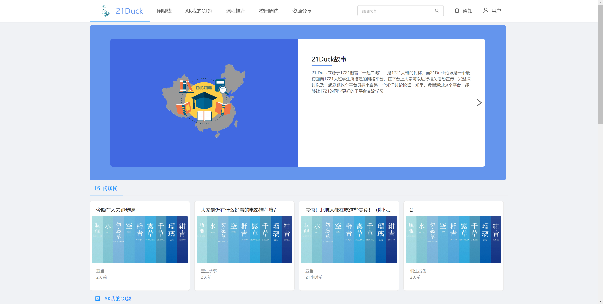

图 1 首页

根据最顶部的版块栏目，选择感兴趣的版块进行阅读或者发表

## 用户登录

点击主页右上角登录按钮，进入登录页面，如图2：

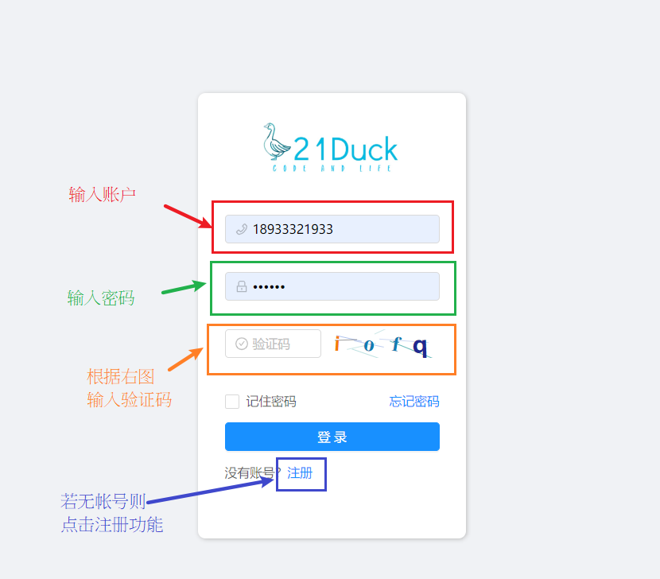

图 2 登录页面

输入用户名、密码以及验证码，点击登录

## 用户注册

若没有已注册帐号，则点击登录下方的注册选项注册新帐号，进入注册页面，如图3：

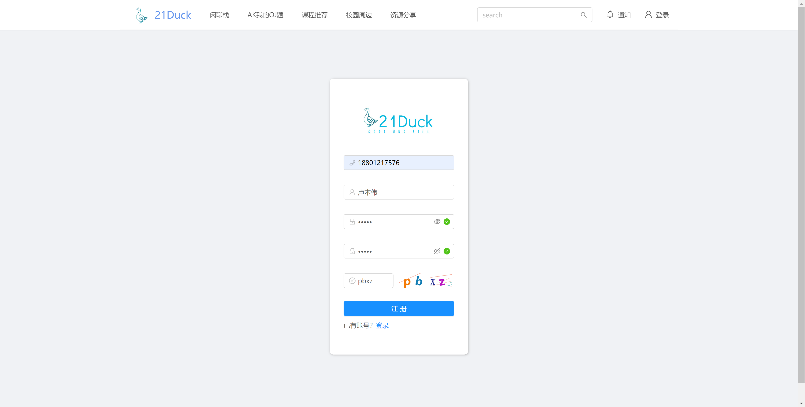

图 3 注册页面

填写相关信息后点击注册，会出现新手上路用户须知弹框，如图4：

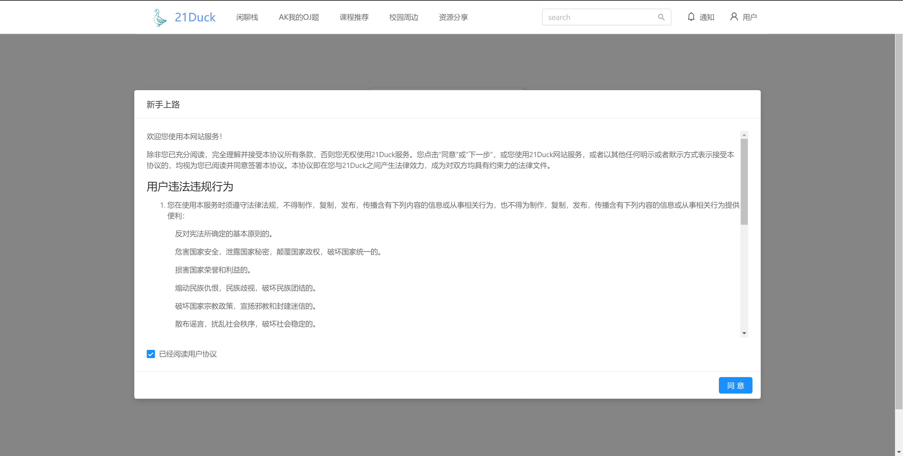

图 4 用户须知

用户须知内容如图5和图6：

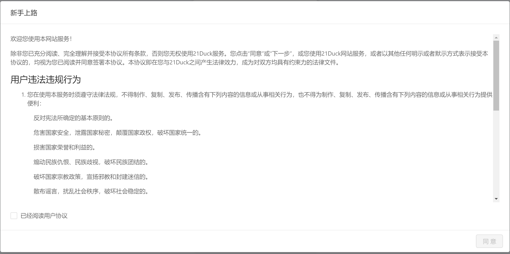

图 5 用户须知内容1

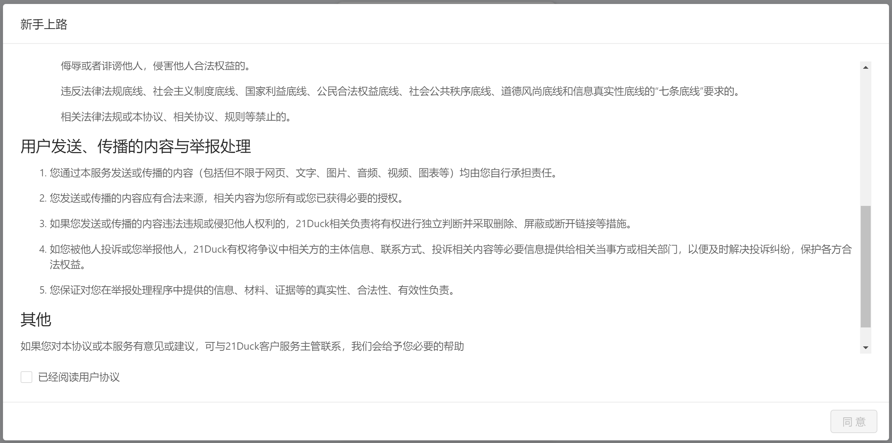

图 6 用户须知内容2

用户需阅读用户协议并打勾后才可注册账户

## 版面布局

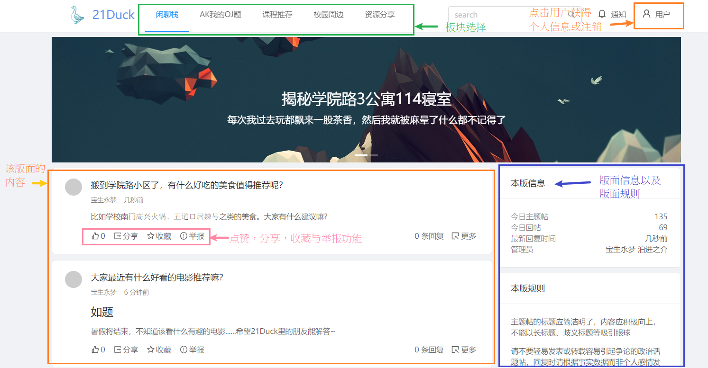

图 7 版面布局

**版块选择**：用户可以选择闲聊栈，AK我的OJ题（OJ题版块）、课程推荐、校园周边和资源分享

**点击用户**：可查看个人信息，注销以及登录

**版面内容**：左下角为展示的版面内容，在每个问题下都有该问题的信息，包括点赞数，分享该问题的链接；点击右方更多可以进入该问题的详情页面

**版面信息**：右方有该版面的版面的信息，如版面今日主题帖数量，版面今日回帖数量，版面最近的回复的时间和该版面的管理员

**发布主帖**：点击右下角“+”号，发布帖子

## 发布主题

如图8，按提示输入标题与内容，按右下角发布按钮发布

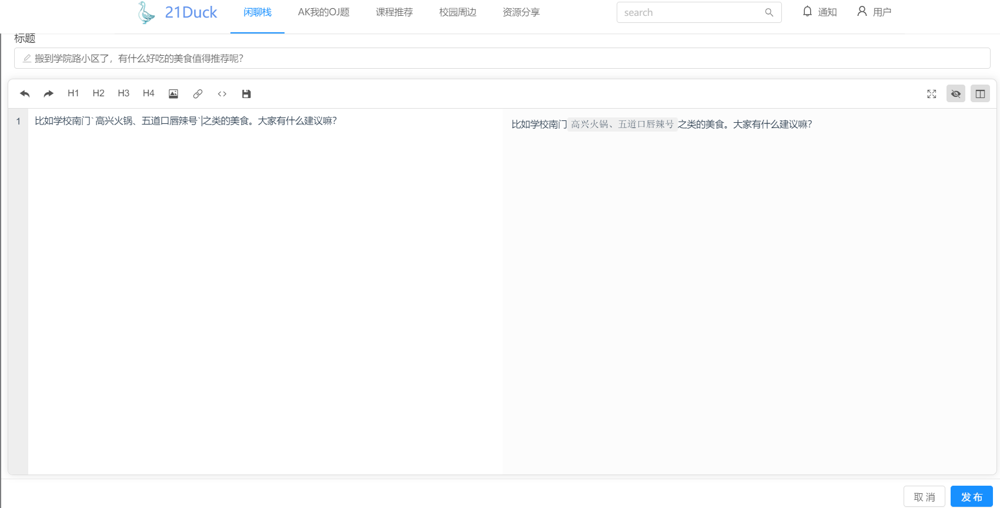

图 8 发布主题

内容使用Markdown语法，左边为Markdown源代码模式，右边为Markdown预览效果

Markdown语法可参照[Markdown教程](https://www.markdown.cn)

可使用左上角的工具栏完成相应的编辑帮助，包括插入链接和插入代码等

## 发表回复

打开主题的更多选项，展示该主题的发表用户用户名，发表的时间以及相应的评论，如图9

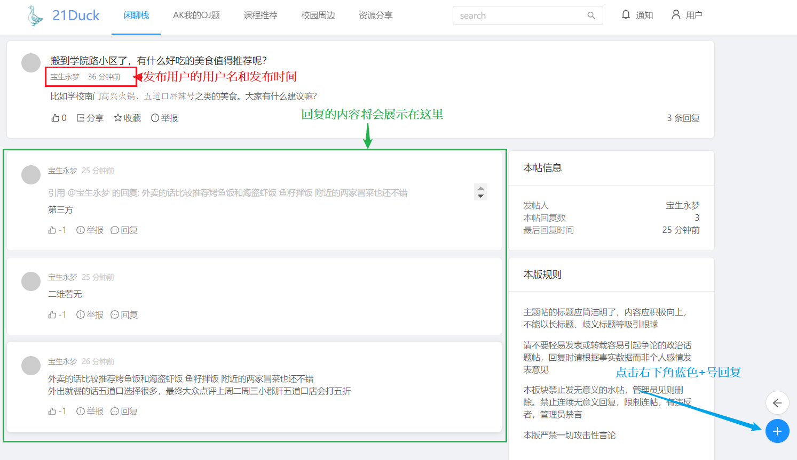

图 9 发布回复

如果需要对该问题进行回复，和发表问题一样点击右下角“+”号即可

发表回复之后将回复内容出现在版面左下角绿框内

## 资源分享

点击资源贴下的下载按钮可以下载资源，如图10

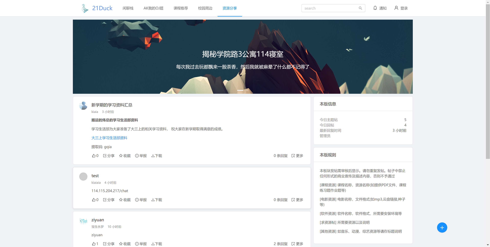

图 10 资源分享

按右下角“+”按钮创建新的资源贴，如图11

图 11 发布新的资源帖

上传后输入资源名称点击发布即可发布成功，如图12

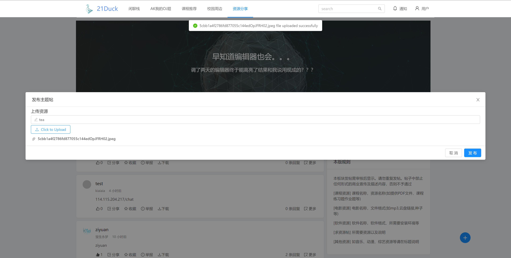

图 12 上传资源

## 个人中心

个人中心布局如图13所示

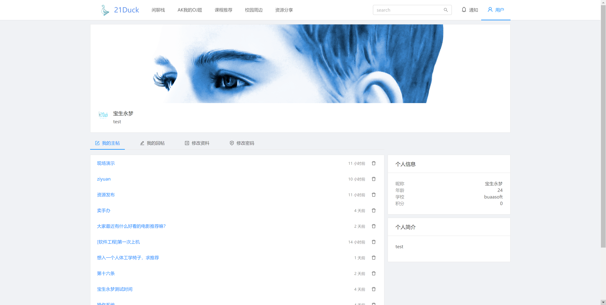

图 13 个人中心

用户可在个人中心修改头像、个人信息和密码，如图14

图 14 修改个人信息

## 管理员功能

管理员可禁言或解禁用户，如图15

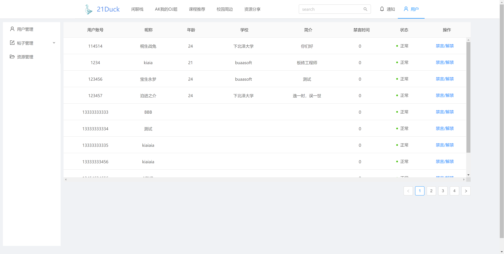

图 15 用户管理

管理员可删除帖子和管理资源，如图16

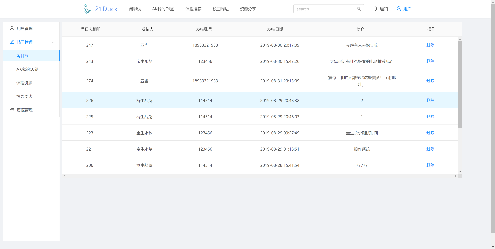

图 16 帖子管理

